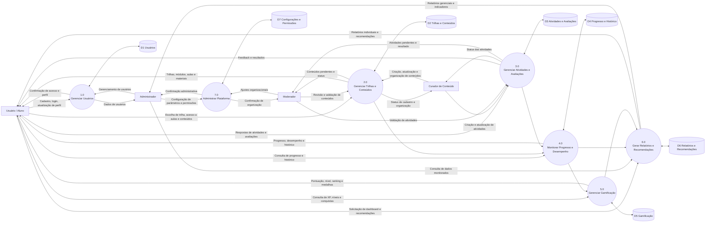

```mermaid
flowchart LR

    %% Entidades externas
    A[Usuário / Aluno]
    B[Curador de Conteúdo]
    C[Moderador]
    D[Administrador]

    %% Processos
    P1((1.0\nGerenciar Usuários))
    P2((2.0\nGerenciar Trilhas e Conteúdos))
    P3((3.0\nGerenciar Atividades e Avaliações))
    P4((4.0\nMonitorar Progresso e Desempenho))
    P5((5.0\nGerenciar Gamificação))
    P6((6.0\nGerar Relatórios e Recomendações))
    P7((7.0\nAdministrar Plataforma))

    %% Depósitos de dados
    D1[(D1 Usuários)]
    D2[(D2 Trilhas e Conteúdos)]
    D3[(D3 Atividades e Avaliações)]
    D4[(D4 Progresso e Histórico)]
    D5[(D5 Gamificação)]
    D6[(D6 Relatórios e Recomendações)]
    D7[(D7 Configurações e Permissões)]

    %% Fluxos - Usuário
    A -->|Cadastro, login, atualização de perfil| P1
    P1 -->|Confirmação de acesso e perfil| A

    A -->|Escolha de trilha, acesso a aulas e conteúdos| P2
    P2 -->|Trilhas, módulos, aulas e materiais| A

    A -->|Respostas de atividades e avaliações| P3
    P3 -->|Feedback e resultados| A

    A -->|Consulta de progresso e histórico| P4
    P4 -->|Progresso, desempenho e histórico| A

    A -->|Consulta de XP, níveis e conquistas| P5
    P5 -->|Pontuação, nível, ranking e medalhas| A

    A -->|Solicitação de dashboard e recomendações| P6
    P6 -->|Relatórios individuais e recomendações| A

    %% Fluxos - Curador
    B -->|Criação, atualização e organização de conteúdos| P2
    P2 -->|Status de cadastro e organização| B

    B -->|Criação e atualização de atividades| P3
    P3 -->|Status das atividades| B

    %% Fluxos - Moderador
    C -->|Revisão e validação de conteúdos| P2
    P2 -->|Conteúdos pendentes e status| C

    C -->|Validação de atividades| P3
    P3 -->|Atividades pendentes e resultado| C

    C -->|Ajustes organizacionais| P7
    P7 -->|Confirmação de organização| C

    %% Fluxos - Administrador
    D -->|Gerenciamento de usuários| P1
    P1 -->|Dados de usuários| D

    D -->|Consulta de dados monitorados| P6
    P6 -->|Relatórios gerenciais e indicadores| D

    D -->|Configuração de parâmetros e permissões| P7
    P7 -->|Confirmação administrativa| D

    %% Processos e depósitos
    P1 <--> D1
    P2 <--> D2
    P3 <--> D3
    P4 <--> D4
    P5 <--> D5
    P6 <--> D6
    P7 <--> D7

    %% Integrações internas entre processos
    P2 --> P4
    P3 --> P4
    P4 --> P5
    P4 --> P6
    P5 --> P6
```