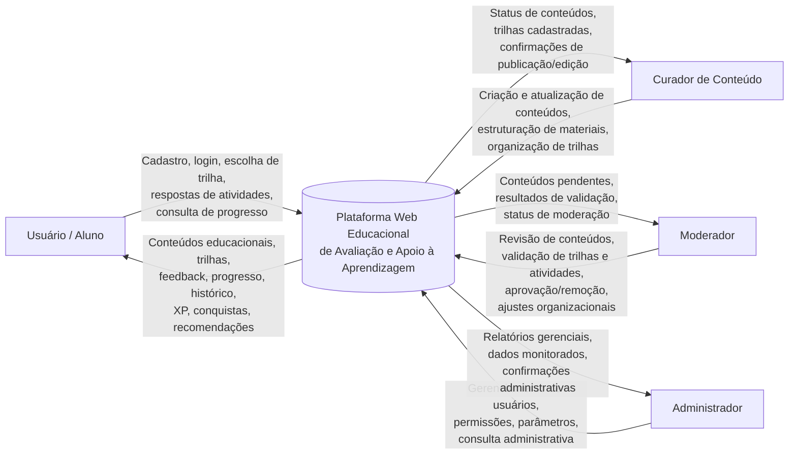

```mermaid
flowchart LR
    A[Usuário / Aluno]
    B[Curador de Conteúdo]
    C[Moderador]
    D[Administrador]

    S[(Plataforma Web Educacional<br/>de Avaliação e Apoio à Aprendizagem)]

    A -->|Cadastro, login, escolha de trilha,\nrespostas de atividades,\nconsulta de progresso| S
    S -->|Conteúdos educacionais, trilhas,\nfeedback, progresso, histórico,\nXP, conquistas, recomendações| A

    B -->|Criação e atualização de conteúdos,\nestruturação de materiais,\norganização de trilhas| S
    S -->|Status de conteúdos,\ntrilhas cadastradas,\nconfirmações de publicação/edição| B

    C -->|Revisão de conteúdos,\nvalidação de trilhas e atividades,\naprovação/remoção,\najustes organizacionais| S
    S -->|Conteúdos pendentes,\nresultados de validação,\nstatus de moderação| C

    D -->|Gerenciamento de usuários,\npermissões, parâmetros,\nconsulta administrativa| S
    S -->|Relatórios gerenciais,\ndados monitorados,\nconfirmações administrativas| D
```
