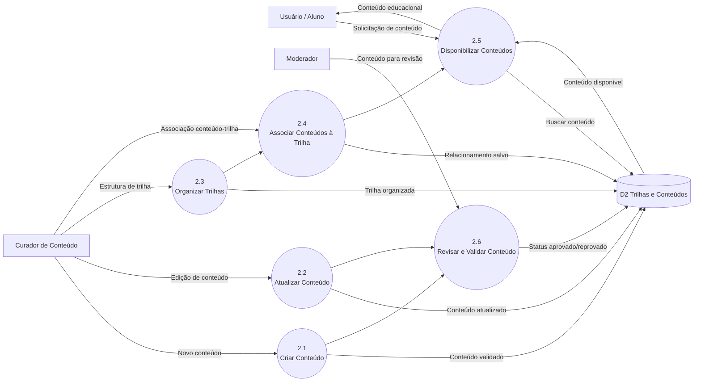

```mermaid
flowchart LR

    %% Entidades externas
    U[Usuário / Aluno]
    C[Curador de Conteúdo]
    M[Moderador]

    %% Subprocessos
    P21((2.1\nCriar Conteúdo))
    P22((2.2\nAtualizar Conteúdo))
    P23((2.3\nOrganizar Trilhas))
    P24((2.4\nAssociar Conteúdos à Trilha))
    P25((2.5\nDisponibilizar Conteúdos))
    P26((2.6\nRevisar e Validar Conteúdo))

    %% Depósito de dados
    D2[(D2 Trilhas e Conteúdos)]

    %% Curador
    C -->|Novo conteúdo| P21
    P21 -->|Conteúdo validado| D2

    C -->|Edição de conteúdo| P22
    P22 -->|Conteúdo atualizado| D2

    C -->|Estrutura de trilha| P23
    P23 -->|Trilha organizada| D2

    C -->|Associação conteúdo-trilha| P24
    P24 -->|Relacionamento salvo| D2

    %% Moderador
    M -->|Conteúdo para revisão| P26
    P26 -->|Status aprovado/reprovado| D2

    %% Sistema → Usuário
    U -->|Solicitação de conteúdo| P25
    P25 -->|Buscar conteúdo| D2
    D2 -->|Conteúdo disponível| P25
    P25 -->|Conteúdo educacional| U

    %% Integrações internas
    P21 --> P26
    P22 --> P26
    P23 --> P24
    P24 --> P25
```
