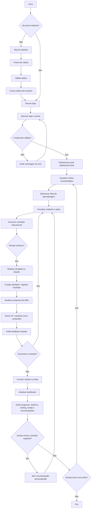

```mermaid
flowchart TD
    A[Início] --> B{Já possui cadastro?}

    B -- Não --> C[Tela de cadastro]
    C --> D[Preencher dados]
    D --> E[Validar dados]
    E --> F[Conta criada com sucesso]
    F --> G[Tela de login]

    B -- Sim --> G[Tela de login]

    G --> H[Informar login e senha]
    H --> I{Credenciais válidas?}

    I -- Não --> J[Exibir mensagem de erro]
    J --> H

    I -- Sim --> K[Redirecionar para dashboard inicial]

    K --> L[Visualizar trilhas recomendadas]
    L --> M[Selecionar trilha de aprendizagem]
    M --> N[Visualizar módulos e aulas]
    N --> O[Consumir conteúdo educacional]
    O --> P{Deseja continuar?}

    P -- Sim --> Q[Realizar atividade ou desafio]
    Q --> R[Corrigir atividade / registrar resultado]
    R --> S[Atualizar progresso da trilha]
    S --> T[Somar XP / atualizar nível / conquistas]
    T --> U[Exibir feedback imediato]
    U --> V{Há próximo conteúdo?}

    V -- Sim --> N
    V -- Não --> W[Concluir módulo ou trilha]

    W --> X[Atualizar dashboard]
    X --> Y[Exibir progresso, histórico, ranking, streak e recomendações]
    Y --> Z{Deseja revisar conteúdo sugerido?}

    Z -- Sim --> AA[Abrir recomendação personalizada]
    AA --> N

    Z -- Não --> AB{Deseja iniciar nova trilha?}
    AB -- Sim --> L
    AB -- Não --> AC[Fim]
```
