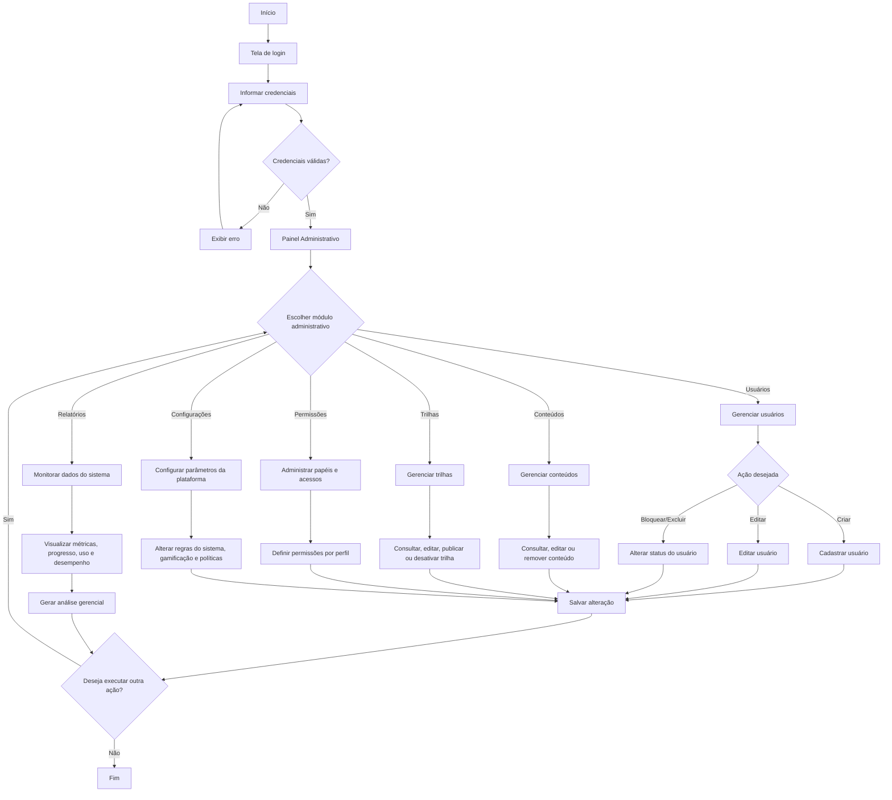

```mermaid
flowchart TD
    A[Início] --> B[Tela de login]
    B --> C[Informar credenciais]
    C --> D{Credenciais válidas?}

    D -- Não --> E[Exibir erro]
    E --> C

    D -- Sim --> F[Painel Administrativo]

    F --> G{Escolher módulo administrativo}

    G -- Usuários --> H[Gerenciar usuários]
    H --> I{Ação desejada}
    I -- Criar --> J[Cadastrar usuário]
    I -- Editar --> K[Editar usuário]
    I -- Bloquear/Excluir --> L[Alterar status do usuário]

    G -- Conteúdos --> M[Gerenciar conteúdos]
    M --> N[Consultar, editar ou remover conteúdo]

    G -- Trilhas --> O[Gerenciar trilhas]
    O --> P[Consultar, editar, publicar ou desativar trilha]

    G -- Relatórios --> Q[Monitorar dados do sistema]
    Q --> R[Visualizar métricas, progresso, uso e desempenho]

    G -- Permissões --> S[Administrar papéis e acessos]
    S --> T[Definir permissões por perfil]

    G -- Configurações --> U[Configurar parâmetros da plataforma]
    U --> V[Alterar regras do sistema, gamificação e políticas]

    J --> W[Salvar alteração]
    K --> W
    L --> W
    N --> W
    P --> W
    R --> X[Gerar análise gerencial]
    T --> W
    V --> W

    W --> Y{Deseja executar outra ação?}
    X --> Y

    Y -- Sim --> G
    Y -- Não --> Z[Fim]
```