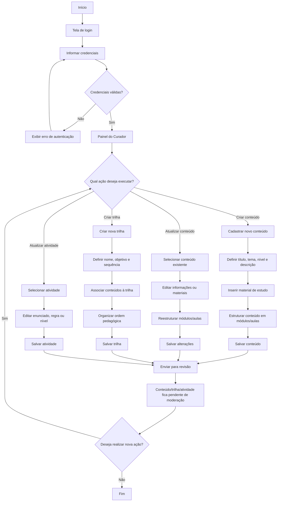

```mermaid
flowchart TD
    A[Início] --> B[Tela de login]
    B --> C[Informar credenciais]
    C --> D{Credenciais válidas?}

    D -- Não --> E[Exibir erro de autenticação]
    E --> C

    D -- Sim --> F[Painel do Curador]

    F --> G{Qual ação deseja executar?}

    G -- Criar conteúdo --> H[Cadastrar novo conteúdo]
    H --> I[Definir título, tema, nível e descrição]
    I --> J[Inserir material de estudo]
    J --> K[Estruturar conteúdo em módulos/aulas]
    K --> L[Salvar conteúdo]

    G -- Atualizar conteúdo --> M[Selecionar conteúdo existente]
    M --> N[Editar informações ou materiais]
    N --> O[Reestruturar módulos/aulas]
    O --> P[Salvar alterações]

    G -- Criar trilha --> Q[Criar nova trilha]
    Q --> R[Definir nome, objetivo e sequência]
    R --> S[Associar conteúdos à trilha]
    S --> T[Organizar ordem pedagógica]
    T --> U[Salvar trilha]

    G -- Atualizar atividade --> V[Selecionar atividade]
    V --> W[Editar enunciado, regra ou nível]
    W --> X[Salvar atividade]

    L --> Y[Enviar para revisão]
    P --> Y
    U --> Y
    X --> Y

    Y --> Z[Conteúdo/trilha/atividade fica pendente de moderação]
    Z --> AA{Deseja realizar nova ação?}

    AA -- Sim --> G
    AA -- Não --> AB[Fim]
```