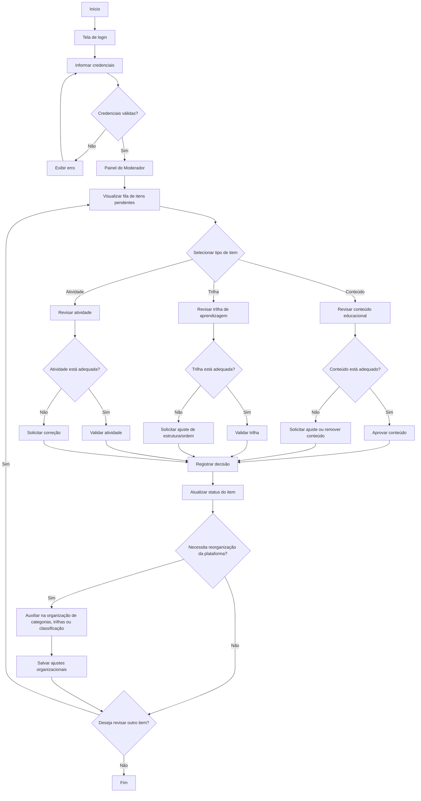

```mermaid
flowchart TD
    A[Início] --> B[Tela de login]
    B --> C[Informar credenciais]
    C --> D{Credenciais válidas?}

    D -- Não --> E[Exibir erro]
    E --> C

    D -- Sim --> F[Painel do Moderador]

    F --> G[Visualizar fila de itens pendentes]
    G --> H{Selecionar tipo de item}

    H -- Conteúdo --> I[Revisar conteúdo educacional]
    H -- Trilha --> J[Revisar trilha de aprendizagem]
    H -- Atividade --> K[Revisar atividade]

    I --> L{Conteúdo está adequado?}
    J --> M{Trilha está adequada?}
    K --> N{Atividade está adequada?}

    L -- Sim --> O[Aprovar conteúdo]
    L -- Não --> P[Solicitar ajuste ou remover conteúdo]

    M -- Sim --> Q[Validar trilha]
    M -- Não --> R[Solicitar ajuste de estrutura/ordem]

    N -- Sim --> S[Validar atividade]
    N -- Não --> T[Solicitar correção]

    O --> U[Registrar decisão]
    P --> U
    Q --> U
    R --> U
    S --> U
    T --> U

    U --> V[Atualizar status do item]
    V --> W{Necessita reorganização da plataforma?}

    W -- Sim --> X[Auxiliar na organização de categorias, trilhas ou classificação]
    X --> Y[Salvar ajustes organizacionais]

    W -- Não --> Z{Deseja revisar outro item?}
    Y --> Z

    Z -- Sim --> G
    Z -- Não --> AA[Fim]
```